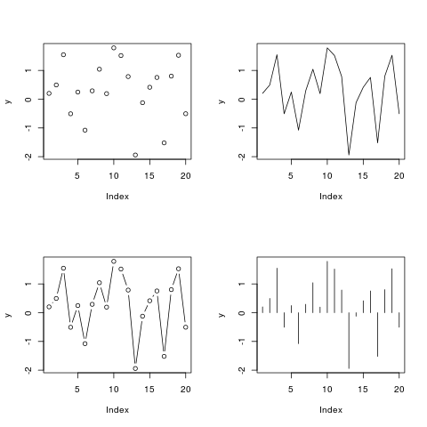

```{r, echo=FALSE, results='hide', message=FALSE, comment=FALSE}
library(knitr)
library(swirl)
source("~/git/ConoceR/Graficando_3_con_2_variables/initLesson.R")
```

¡Hola! Bienvenido a esta tercer lección de graficar. Usted va a hacer más gráficas con pares de variables en esta lección.
  
Espero que se siente cada vez más cómodo con el uso de R, y que ya tiene su álbum de recortes creciendo con ejemplos de código útil para realizar sus propias presentaciones. Muy pronto, usted tiene que presentar una obra propia a sus compañeros como tarea de calificación.

Copíe y pegue este código en la consola para habilitar los datos que se necesita en la lección:
```{r}
.pathtofile <<- function(course_, lesson_, file_){
  if(as.character(packageVersion("swirl")) > "2.2.21"){
    file.path(get_swirl_option("courses_dir"), course_, lesson_, file_)
  } else {
    file.path(find.package("swirl"), "Courses", course_, lesson_, file_)
  }
}

# Make path to csv available to user
path2csv2 <- file.path(path.package('swirl'), 'Courses',
                       'ConoceR',
                       'Graficando_3_con_2_variables',
                       'hijosDetalle.csv')
```
  
Antes de empezar, quería enseñarle una característica de R que no se he comentado todavía. En la última lección usted utilizara unos argumentos a la función par() para cambiar las dimensiones de las margenes externas para acomodar los nombres de las provincias de El Ecuador.  Acabara de aparecer una imagen de cuatro gráficas en la ventanilla PLOTS que demuestra el uso de un argumento que divide el espacio en filas y columnas para acomodar gráficas múltiples.



El argumento que utilicé fue mfrow() lo cual es otro argumento muy útil de par(). No tengo ni idea porque el argumento se denominó mfrow, pero, por si a caso que le ayude recordarlo, digamos que es una sigla para Matriz de  Figuras por ROWs (filas). En el indicador (>) teclée par(mfrow = c(2,2)). Se lo explico en seguida.
  
```{r}
par(mfrow = c(2,2))
```

La instrucción que usted acaba de darle a R es que divida el espacio de una salida grafica en partes iguales; la parte 'c(2, 2)' especifica el numero de filas (2), luego el numero de columnas (2) (pudieran haber sido otros valores, y se podría volver el adjuste a 'c(1,1)' para que R imprima una gráfica en la ventanilla entera). La parte del argumento ROW (fila) refleja que R va a llenar este espacio por filas, empezando con el espacio superior a la izquierda. Existe un argumento muy parecido mfcol() que llenara los espacios por columnas. Sin embargo, puesto que usted controla el orden de realizar las graficas, no importa tanto cual escoge usted. Yo siempre uso mfrow().
  
Muy bien, ahora, usted va a reproducir la imagen de las cuatro gráficas. Ya usted estableció el espacio con mfrow(), necesita generar unos datos. Escriba k <- rnorm(20) para crear un objeto k que tomara 20 números aleatorios de una distribución normal (simétrica, con media 0).
  
```{r}
k <- rnorm(20)
```

Eche un vistazo a los datos antes de graficarlos por teclear 'k', el nombre del objeto.
  
```{r}
k
```

Haga la primera gráfica, la cual va a aparecer en la parte superior a la izquierda, por ingresar este comando plot(k, type = 'p').  De hecho, type = 'p' es la condición base del argumento type (tipo) pero usted va a declararlo para ver la comparación con lo que sigue. Dese la oportunidad ahora.
  
```{r}
plot(k, type = 'p')
```

Acuérdese que el comando para dividir el espacio era mfrow, y esto impliclara una secuencia particular de llenar el espacio. Antes de seguir, entonces, ¿dónde se espera que aparecerá la siguiente gráfica entonces?
  
* A la derecha de la que ya esta  
* Por debajo de la que ya esta  
* En la posición diagonal  
* por abajo a la derecha  

Ya verá usted. Escriba plot(k, type = 'l') para realizar la siguiente gráfica. Fíjese que el comando es lo mismo que usted realizó para la última gráfica, a parte del cambio de la 'p' de puntos para la 'l' de linea.
  
```{r}
plot(k, type = 'l')
```

Ahora la tercera. Tome nota que con esta sería de gráficas usa usted el mismo conjunto de 20 valores, solo está cambiando la instrucción a R sobre el tipo de gráfica. La siguiente es con 'b' para both, o amBos tipos, puntos y lineas juntos. Teclée plot(k, type = 'b').
  
```{r}
plot(k, type = 'b')
```

Por la última gráfica de este juego, teclée plot(k, type = 'h'). Esta produce una gráfica tipo histograma (aunque hay valores negativos que no se esperaría de una histograma clásica) que toma el valor 0 como referencia de donde las lineas salen hacia los destinos de cada valor del objeto k. Tal vez mi explicación tendrá mas sentido cuando la hayas visto. Dese la oportunidad como el susodicho comando plot(k, type = 'h').
  
```{r}
plot(k, type = 'h')
```

A mi la función plot() me parece muy flexible. Creo que la impressión distinta de cada gráfica destaca la importancia de pensar en cuales objetos se escoge para gráficar un conjunto de valores. El cambio de puntos para la linea inmediatamente da un sentido de dirección y significado a la nube de valores, pero precisamente por eso no es necesariamente una buena opción, si dirección no hay en los datos en sí. De igual manera, la última gráfica en el estilo de histograma afecta un cambio algo radical a la gráfica en que sugiere que el valor 0 es una referencia muy importante.
  
Es importante darse cuenta que cambios a la función par() permanecen en la sesión. Por ejemplo, nuevos gráficas aparecieran según esta misma secuencia de arriba y izquierda, luego arriba derecho, luego abajo y izquierda  etcétera. Para reinicar todos los ajustes de la función par a sus condiciones de base, se puede teclear dev.off(). Este comando quiere decir algo como 'apague el dispositivo gráfico'. El dispositivo, tanto como los ajustes, se refresca al recibir una nueva instrucción para graficar. Dese la oportunidad ahora, teclée dev.off().
  
```{r}
dev.off()
```

Si usted quiere revisar el estado de los ajustes de par() en algún momento, se puede teclear par() no más, con los paréntesis vacios. Esto imprime una lista de los ajustes de cada argumento que acepta la función par. Cabe señalar que hay argumentos que controlan detalles dentro del par pero su uso no es muy común. Para leer lo que hace cada argumento, se puede teclear ?par en el indicador sin paréntesis. Pero ahora, debemos seguir con gráficas de dos variables.
  
Como usted sabe, existen miles de opciones para hacer una gráfica. En esta lección, igual que en las lecciones anteriores, le voy a enseñar una acá, y más en el vídeo. Podemos conversar en opciones para ejemplos propios que tengan ustedes en el curso. Todo depende de su propósito o la idea que usted quiera  probar con una gráfica o  presentación. Sin un propósito o destino, se puede  jugar y tal vez le saltara algo lindo, pero siempre es más fácil adelantarse  cuando tenga un propósito.
  
De hecho, usted ya hiciera una gráfica de dos variables cuando hizo el diagrama de cajas con los datos del número de hijos y hijas que tiene la mujer de promedio de cada provincia de El Ecuador, separados por alfabetización.  Seguimos con ese conjunto de datos, que hubiera cargado en el fondo cuando usted lanzó la lección actual. Para ubicarse, reproduzca la gráfica del número de hijos y hijas condicionado en alfabetización con este comando boxplot(detalle$hijos ~ detalle$leer.escr).
  
```{r}
boxplot(detalle$hijos ~ detalle$leer.escr)
```

Espere, antes de seguir, entonces, ¿esta gráfica es la misma que usted hizo unas lecciones atrás, o no?
  
* No  
* Si  

La diferencia no es en el código o comandos para la gráfica, sino en el conjunto de datos. Tenemos categorias adicionales en este caso, etiquetadas 'juntos', que nos proporcionan resumenes. En esta gráfica vemos un resumen, y una subdivisión por alfabetización. Pero hay más aún en estos datos.
  
Para revelar un poco más del detalle, teclee el siguiente 'with(detalle, boxplot(hijos~area*leer.escr))'. No se asuste de la introducción de 'with( , )', es un formato alternativo para evitar el uso del nombre del conjunto y el $ (detalle$). Escríbalo de arriba para visulaizar este paso ahora.
  
```{r}
with(detalle, boxplot(hijos~area*leer.escr))
```

Pffff, ¿qué tenemos acá? Pues, hacemos una cosa, le sugiero un cambio que le va a ayudar entender el contenido y luego me vaya a proponer, con los compañeros en el espacio de foro, unos mejores para esta gráfica para que su cuento salte. Gire las etiquetas del eje X por ingresar las=2, después de una coma, antes de los dos paréntesis de cierre al final del comando que utilizó para realizar la gráfica actual. Recuperar ese comando y ingrese el cambio mencionado.
  
```{r}
with(detalle, boxplot(hijos~area*leer.escr, las = 2))
```

Cabe indicarle el sintaxis del comando. Con ello pedimos los datos de 'hijos', la variable dependiente, divido por las combinaciones de 'area' (urbana, rural, y juntos (combinados)) y 'leer.escr' (SI sabe, NO lo sabe, y juntos (combinados)). El asterisco o símbolo de multiplicación * es lo que manda que R grafica las combinaciones de area por leer.escr.
  
¿Ya tiene claro que quiere decir las etiquetas provisionales que  ha puesto el programa según el código? Tenemos datos de los promedios por las provincias de todo el páis etiqueteados como 'juntos.juntos'. Luego dos cajas cuya contenido respectivamente los promedios de cada provincia según pertenecen a àreas urbanas o rurales. Luego, tres gráficas para las partes de la muestra en cuanto si supo leer y escribir, o que si no lo supo. Para probar si me explico, déjeme preguntarle algo específico. Antes de seguir, entonces, ¿escoja una las siguientes interpretaciones NO sea correcta?

* Algunas cajas tienen varios valores por provincia según el contexto  
* Cada caja se constituyó de un valor para cada provincia  
* Cada valor de promedio que compone cada caja representa más o menos mujeres según el contexto  

Al pensar en como se podría mejorar la gráfica, no se debe limitar a los cambios que usted sabe realizar ya, sino se puede sugerir cualquier idea que le ocurra. Se podría jugar con las posibilidades directamente en R mismo, o se podría empezar con un croquis con un lapiz y una hoja de papel, como suelo hacer yo. ¿Tal vez sería mejor en gráficas aparte?
  
Pues, dejamos esta lección acá, depués de un paso más en un análisis exploratorio de este conjunto de datos interesantes de El Ecuador. Tengo ganas de ver sus propios experimentos con gráficas y presentaciones, ¡y en el próximo módulo usted tendrá una gran oportunidad de mostrar un poco de sus propios talentos y gustos!
  
Hasta la próxima vez que nos vemos en linea, le deseo mucho éxito en todos los labores académicos.