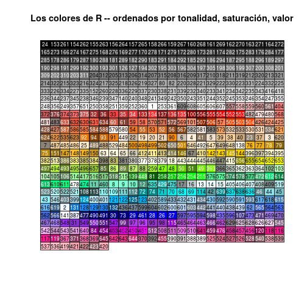
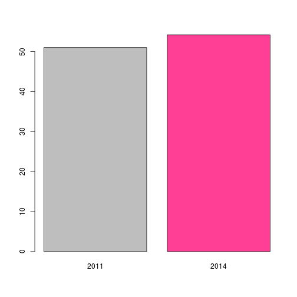
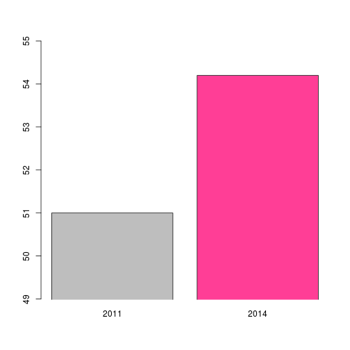
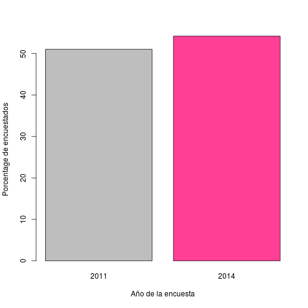
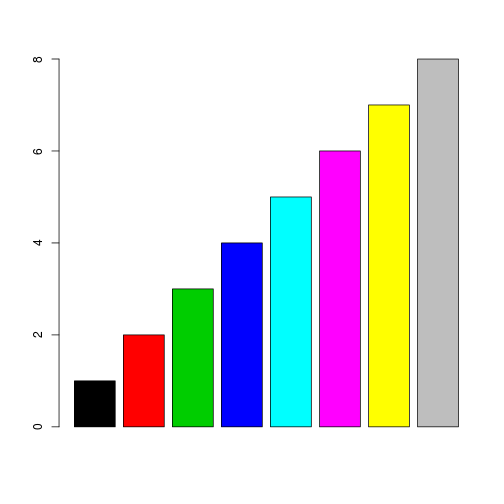
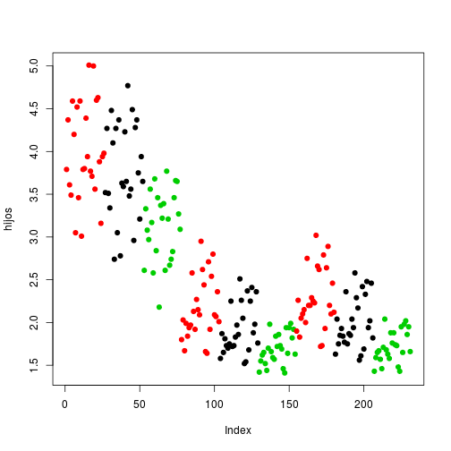

# Color
Bienvenidos a la sessión. En esta oportunidad usted explorará las
  opciones con color en el sistema básico de graficar en R. Cuando digo en R, 
  espero que usted esté trabajando en RStudio siempre para este curso.

Antes de empezar, usted necesita ejecutar este código para cargar algunos elementos en su sesión.

```r
require(swirl)

.pathtofile <<- function(course_, lesson_, file_){
  if(as.character(packageVersion("swirl")) > "2.2.21"){
    file.path(get_swirl_option("courses_dir"), course_, lesson_, file_)
  } else {
    file.path(find.package("swirl"), "Courses", course_, lesson_, file_)
  }
}

# Make path to csv available to user
path2csv2 <- file.path(path.package('swirl'), 'Courses',
                       'ConoceR',
                       'Graficando_3_con_2_variables',
                       'hijosDetalle.csv')

detalle <- read.csv(path2csv2)
```

Ya que usted conoce a R, no le va a sorprender que hay muchas maneras
  de trabajar con color, y incluso unos paquetes con paladares alternativos. Nos quedamos con los básicos en esta sessión.

R tiene nombrado 657 colores, y se puede llamar a ellos por su nombre,
  o varias codificaciones de color como hexadecimal o RGB valores. Para ver la 
  lista de los colores, teclee colors(). Dese la oportunidad ahora.


```r
head(colors())
```

```
## [1] "white"         "aliceblue"     "antiquewhite"  "antiquewhite1"
## [5] "antiquewhite2" "antiquewhite3"
```

En la ventanilla de PLOTS hubiera aparecido, o empezado de aparecer,
  una representacíon de los 657 colores ordenados por tonalidad, saturación, y 
  valor.

 

Esta tabla se cita mucho en las fuentes en linea de R. Usted puede
  consultarla, y otras configuraciones útiles, en esa página 
  http://research.stowers-institute.org/efg/R/Color/Chart/index.htm. Si usted
  encuentra un recurso semejante en castellano, ¡compártalo con nosotros por el
  foro!
  
Muy bien, ¿pero como le va a ayudar esto? Pues, con el código numérico
  que se ve en la tabla de colores, se puede llamar al nombre del color en su
  gráfica. A mi me llama la atención el color número 642, así vamos a conocerlo.
  Ya hemos visto que el objeto que almacena los colores se llama colors(),
  ¿verdad? Pues a este comando vamos a especificar el número del color que 
  queremos destacar en corchetes cuadrados [], así colors()[642]. Inténtelo.
  

```r
colors()[642]
```

```
## [1] "violetred1"
```
Aunque le parezca un poco torpe, este comando pide el color con índice
  642 de todos los colores.
  
OK, ahora ustd va a llamar este color para reconstruir la gráfica que vimos
  en el vídeo de las opiniones de la gente de Bogotá sobre sus vidas. Las
  primeras cifras de la gráfica superior fueron 51 % en 2011 quienes creyeron 
  que su nivel de vida ha mejorado en los 5 años anteriores, comparado con 54.2%
  en 2014.

Primero con el color que sale por defecto,
  proporcione usted los siguientes argumentos a la función barplot(). Primero
  tiene que especificar la altura (height) de las barras así height=c(51, 54.2),
  y luego un argumento para los nombres (etiquetas) de las barras, así
  names.arg=c('2011', '2014'). Envuelve los dos argumentos en la función
  barplot(), seperados por una coma, para empezar.


```r
barplot(height = c(51, 54.2), names.arg = c('2011', '2014'))
```

 

Usted va a añadir ese color 'violetred1' entonces. Como hicieron ellos de la 
  oficina del alcalde de Bogotá, queremos que sobresale 2014, así que dejarémos
  2011 en gris. Recupere el comando anterior y despues de una coma, modifique la
  llamada a barplot() con el siguiente col = c('grey', 'violetred1').


```r
barplot(height = c(51, 54.2), names.arg = c("2011", "2014"), 
  col = c("grey", "violetred1"))
```

 


En este momento podríamos reproducir el efecto del corte del eje que 
  hicieron ellos de la oficina del alcalde. ¿Se acuerde que tan fuerte parecía 
  la diferencia entre 2011 y 2014 en su gráfica? Se lo hace por introducir otro
  argumento ylim = c(49, 55) - ya que estos fueron los limites de su versión
  de la gráfica, pero también tenemos que ingresar otra argumento xpd=FALSE. 
  Inténtelo usted, recupere el último comando otra vez y añádale los dos
  argumentos mencionados.


```r
barplot(height = c(51, 54.2), names.arg = c("2011", "2014"), 
  col = c("grey", "violetred1"), ylim = c(49,55), xpd = FALSE)
```

 

¡Vaya cambiazo, verdad! Esta versión es más llamativa, pero no es
  una buena practica, así vamos a quitar los últimos dos argumentos con los 
  cual cambiara el eje Y. Lo que si usted debe introducir en el comando son las
  etiquetas para los ejes. En este paso usted debe quitar los argumentos a ylim
  y xpd, y añadir ylab='porcentage de encuestados' y xlab = 'Año de la encuesta'."


```r
barplot(height = c(51, 54.2), names.arg = c('2011', '2014'), 
  col = c('grey', 'violetred1'), 
  ylab='Porcentage de encuestados', 
  xlab='Año de la encuesta')
```

 
Bueno, le desvié un poco con esto de la escala del eje Y, regresamos
  al tema de color. A propósito, si a usted le gustaría destacar diferencias
  pequeñas como vemos en este ejemplo, toca seleccionar un gráfico de puntos.
  
De hecho, hay una manera aún más sencillo para introducir un juego
  limitado de colores dentro de gráficas.  R tiene un paladar de 8 colores que
  se puede llamar por el número. Usted los hubiera visto en el vídeo en la 
  gráfica bien fea mía. Se los puede ver por teclear el siguiente 
  barplot(1:8, col=1:8).
  

```r
barplot(1:8, col=1:8)
```

 

A propósito, algunos de los expertos en visualización opinan
  diferente en la cuestión de cuál color es más fiable cuando le toca añadir
  color para destacar algo. En sus libros Edward Tufte propone rojo, pero ayer
  vi un autor opinando que para pantallas y fuentes del internet, azul suele
  ser la mejor opción.  Yo no tengo opiniones fuertes en este asunto, aunque 
  supongo en mi práctica voy con rojo. Rojo se llama con col=2, y azul con col=4.
  
Ojo - estos numeros no tienen nada que ver con los
  índices de los colores en la tabla completa de colores que usted vio antes.
  Por ejemplo el índice para blanco en la tabla completa era 1, así que lo llamara
  por col=colors()[1], mientras que 1 en esta serie limitada de colores llama al color negro, y con el sintaxis col=1.  

Una aplicación super útil en R es asignar color por una variable de
  agrupación o factor. En el fondo le hemos cargado un conjunto 'detalle' que lleva los
  datos del número promedio de hijos y hijas que tenían las ecuatorianas según
  el censo de 2010.  Confirme que está vigente en la sessión con head(detalle).
  
En este paso usted va a graficar todos los valores en el conjunto,
  pero especificar que el color siga la variable area. Area es la variable que
  cuenta si la encuestada pertencía de una zona urbana o rural.  Así se hace
  with(detalle, plot(hijos, col = area)). Dese la oportunidad.


```r
with(detalle, plot(hijos, col = area, pch=19))
```

 
Para entender esta vista de los datos, hay que acordarse que en este
  conjunto tenemos datos promedios por cada provinicia de El Ecuador, y luego 
  desglosados por alfabetización y la zona, rural o urbana.

# Anotaciones

¿Le parece que añadimos unas anotaciones a esta gráfica? Empezamos
  con unas palabras. Todos las gráficas y por lo tanto lo que podemos añadir 
  como anotaciones necesita información sobre las coordinadas de forma precisa
  o, bajo ciertas condiciones, vaga. Añada las palabras ¿cuál color va con cuál
  nivel de área?.  Este texto va entre comillas con el argumento labels=''. 
  También, usted tiene que especificar un lugar. Digamos que x sea 150, e y 
  sea 4. Ensamblar estos detalles dentro la función text() ahora en el indicador
  de RStudio.


```r
text(x=150, y=4, labels='¿cuál color va con cuál nivel de área?')
```

Si usted quiere romper lineas en el texto, hay que ingresar la
  combinación "\\n" en el lugar donde quiere que divide el texto.  Le sugierso que
  experimenta con las opciones de más del función text(), los cuales brindan
  un nivel de contro muy fino.
  
Usted reconocerá que algunos técnicas, como lo de añadir texto, 
  podrían hacerse con igual o mayor facilidad en un programa de terceros. Sin 
  embargo, no hace daño aprenderlas en R.
  
Si usted quisiera añadir una linea para destacar algún umbral en 
  la gràfica, hay varias opciones. Se puede utilizar la función abline() cuya nombre 
  quiere decir trace una linea entre a y b.  Imagínese que queremos isladar el
  primer tercio (más o menos) del espacio, donde hay las mujeres que no sabían
  leer ni escribir. La función abline() tiene hace más cosas, pero ahora solo
  queremos pedir que nos añade una linea vertical alrededor de donde 77 en el
  eje X. Teclee abline(v=77) entonces, para una linea v para vertical.


```r
abline(v=77)
```
Super sencillo verdad? Para lineas horizontales haríamos algo muy
  parecido, aunque con h en lugar de v.

Para especificar una linea que empieza y termina donde usted quiera,
  utilzamos segments(). Esta función require más argumentos, porque tenemos que
  proporcionar las coordinadas en las dimensiones x y y. Sería más facíl entender
  con un ejemplo. Digamos que quiero trazar una linea que empieza en nuestra
  recta vertical en 77 y va en el plano horizontal hasta 200 en la altura que
  cabiera los datos de las alfabetizadas, y los datos para alfabetizadas y no
  alfabetizadas juntas. Lo voy a hacer mas gruesa también con lwd=. La receta 
  es así segments(x0= 77, x1=200, y0 = 3.2, y1 = 3.2, lwd=2)


```r
segments(x0= 77, x1=200, y0 = 3.2, y1 = 3.2, lwd=2)
```

Ya se hubiera dado cuenta que con esta función puede dibujar una
  linea entre cualquier par de puntos en el espacio que establece el cuadro.

Desde luego, le he hecho crear un pequeño disastre acá, metiendo estos
  elementos sin razón. Sin embargo, la idea es que usted aprenderá la técnica
  y lugeo la puede aplicar en un contexto donde tiene sentido. Siguemos, ¿no?
  Para flechas, los argumentos son parecidos a los de segments, aunque tenemos
  que meter unos más para la forma del punto de la flecha. Pruebe esto
  arrows(x0= 77, x1=200, y0 = 3.2, y1 = 3.2, lwd=2, length = 0.5)


```r
arrows(x0= 77, x1=200, y0 = 3.2, y1 = 3.2, lwd=2, length = 0.5)
```

Lo que usted necesita más que nada es practicar. Le animo practicar
  en un espiritu de diversión y aventura. Si no le sale algo, inténtelo de otra
  manera, o escriba en el foro sobre su inconveniente.  Con el R, siempre hay 
  varias maneras de lograr cualquier cosa, y el internet es una fuente muy rica
  de buen consejos y ejemplos hechos.

Note que muchos de los ejemplos dentro de estas lecciones no llevan
  los elementos imprescindibles de etiquetas para los ejes con unidades de
  medida, títulos, etcétera.  Lo hacemos así para enfocarle en lo nuevo de la
  lección, y para que los comandos sean más ligeros. Sin embargo, sus obras 
  siempre deben llevar estos elementos.  Pues, seguro que le he quedado con
  dudas, pero ¡por eso tenemos el foro! Nos vemos allí.  
