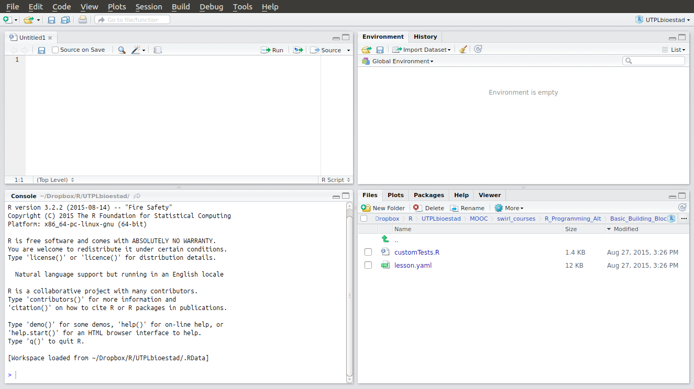
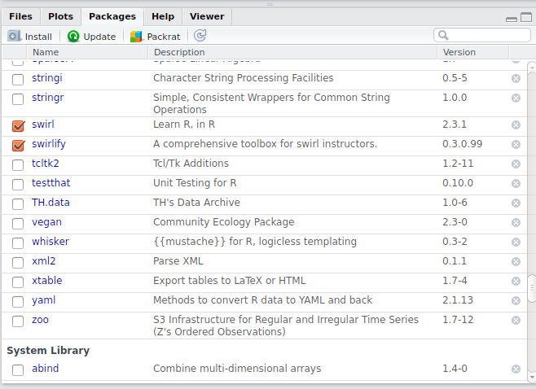
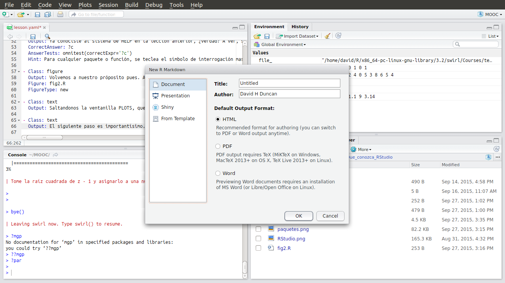
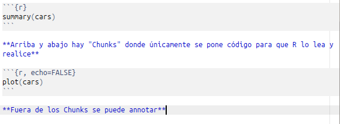

```{r, echo=FALSE, results='hide', message=FALSE, comment=FALSE}
library(knitr)
library(swirl)
require(png)
source("~/git/ConoceR/Que_conozca_RStudio/initLesson.R")
```

En esta lección, conocerás mejor a RStudio. Aunque ningun análisis, gráfico o resultado que haremos en el curso requiere RStudio, estoy convencido que la aumentacion y conveniencia que se ofrece vale la pena.
  
Esta pequeña introducción al programa RStudio te dará lo mínimo absoluto para que te ubiques y aproveches de lo que se ofrece. Para una visión más completa, véase a la página web www.rstudio.com/products/rstudio/features/
  
Espera...Ya estás viendo esta lección desde RStudio, ¿cierto? Vamos a ver. Debe haber aparecido una imagen a la derecha de la pantalla, la que es como se ve la interfaz de RStudio por defecto. ¿La ves? ¿Corresponde al entorno en que te encuentres ahora mismo?



Si no corresponde, esta lección no te sirve en este momento. Presione ESC para terminar la lección. Puedes volver en otro momento cuando tengas RStudio instalado y abierto.
  
Vamos a enfocarnos en las ventanillas que se ve in la imagen. Deben reproducir las ventanillas verdaderas que se ve en el programa. Puede que haya una diferencia ligera. Puede que veas tres ventanillas en el programa mientras que hay cuatro en la imagen.
  
Para que veas algo más parecido, si solo tienes tres ventanillas en el programa, hagas click en el ícono arriba a la iquierda de una cajita blanca con un plus verde. Escoja la primera opción para crear un nuevo archivo tipo R Script. Nota se podría realizar lo mismo por teclear CTRL + SHIFT + N.
  
Otra opción aún sería con menu File > New File > R Script. Personalmente, no suelo usar el menu, el programa manejo principalmente por teclado y ratón.
  
Bueno, empezamos donde hayas estado trabajando hasta aquí, en la consola. Antes de seguir, entonces, ¿como se llama este espacio en inglés?

* Files  
* Console  
* Untitled1  
* Environment  

A la derecha de la consola varias ventanillas comparten un espacio. Antes de seguir, entonces, ¿cómo se llama la ventanilla donde la imagen del interfaz de RStudio surgió?

* Files  
* Console  
* Environment  
* Plots  

Antes de adelantarnos, nota que en la barra de la ventanilla de Plots hay botones para Zoom y Export. Pulse cada uno en turno, pueda que luego te los sirvan.
  
Hay cuatros ventanillas más con Plots. Desde la derecha entonces, primero hay Viewer. Olvídete de ella, no alcanzarás a esas alturas durante este curso.  Luego hay HELP donde se encuentra ayuda en las funciones, argumentos y paquetes. Meta el cursor en la cajita blanco de la barra de la ventanilla HELP y empece a teclear algo. Verás una lista de funciones para que se pueda buscar información y guianza en el uso.
  
Ya conocieras al sistema de HELP en la lección anterior, ¿verdad? A ver, si quieres lanzar el sistema de ayuda en el uso de la función c por ejemplo, ¿qué escribas en la consola?
  
```{r}
?c
```

Volvemos a nuestro próposito pues. A la izquierda de HELP se encuentra PACKAGES (paquetes). Al hacer click en ella, se ve la lista de paquetes instalados en tu sistema. Los que están activos tengan un tick a la izquierda, como se ve en la imagen que haya aparecido hace un segundo en la ventanilla PLOTS. Tu lista no sea igual, se espera que tuvieras menos paquetes por ejemplo.
  


Saltandonos la ventanilla PLOTS, que ya conoces, más a la izquierda aún está FILES. Esta es un explorador y lanzador útil de archivos. Lo útil que sea, ten claro que el único tipo de archivo que no lanza bien son archivos de datos. Pero imagenes, y archivos de código si se puede.
  
El siguiente paso es importantísimo. Vamos a crear otro archivo de código, o guión, que te va a servir como un álbum de recortes para código éxitoso y notas sobre ello. Con el menu FILE, o el botón abajo de ello, elige la segunda opción 'R Markdown'.
  
Haya aparecido una ventanilla pidiéndote unos detalles igual a ella que haya acabdo de aparecer como imagen en la ventanilla PLOTS. Pulse Zoom si no lo ves bien. En su ventanilla real, acepta las opciones por defecto, pero asegure que lleva tu nombre y denomine bien el archivo donde dice 'Untitled'. Pulse OK y el archivo aparecere en la parte arriba izquierda



Guardalo en tu carpeta trabajadora para este curso. Una vez guardado, pulse el boton Knit HTML para ver lo que pase.
  
¡Super chevere! 'Knit' significa tejer, y acabaras de tejer una mezcla de codigo para R más texto simple hasta un archivo de HTML. Este se denomina programación alfabetizada, o literate programming en inglés. ¡Imagínate la envidia que vas a crear en las fiestas con esto! A propósito, antes de seguir, entonces, ¿sabes que significa la sigla HTML?

* HyperText Markup Language  
* ¿Hola, Te Molan Langostinos?  
* Hay Tierra Muy Lindo  

No vas a desarrollar codigo en este archivo, sino guarda código útil y comentarios para un uso futuro. Mejor que conozcas al formato ahora mismo para que no te asuste luego. Las pocas reglas importantes hayan aparecido en un imagen a la derecha.
  


Bueno, dos cositas mas antes de despedirnos de esta clase. En la parte arriba, derecha, hay dos ventanillas mas denominados ENVIRONMENT y HISTORY. Quieren decir entorno virtual y historia de comandos realizados, respetivamente. El entorno te muestra los objetos que el programa tiene activo en la memoria, o, en terminos técnicos, el entorno. Asegurate que la ventanilla ENVIRONMENT esta por delante de HISTORIA por hacer click en el nombre. Luego vas a crear un objeto 'elProfe' y asignarlo *mí* nombre. Ahora, por favor.
  
```{r}
elProfe <- "David Duncan"
```

Ahora se ve este objeto en la ventanilla ENVIRONMENT, cierto? Cualquier objeto en el entorno se puede imprimir a la consola tecleando el nombre no mas. En la consola pues, escriba elProfe para ver el contenido de tu objeto.
  
```{r}
elProfe
```

Tambien, ya hubieras visto que se puede imprimir una lista de los objetos en el entorno a la consola tecleando ls(). Pruebalo!
  
```{r}
ls()
```

Por ultimo, imagínate que hayas escrito un renglon de codigo que salio bonito, y lo quieres guardar para el futuro. Haz click en el tabulador HISTORY y escoge un renglón que te guste. Luego, en la barra de esa ventanilla, pulse 'To Source' y nota que el renglón ahora aparece en tu documento de código a la izquerda, parte arriba. Convéncete que funciona.
  
Sin embargo, si solo quieres realizar el renglón de nuevo se puede pulsar 'To Console', para que aparezca en la consola, listo para pulsar Intro. Claro, si quieres repetir un renglón de hace poco tiempo, mejor uses la flecha arriba para convocar el comando nuevamente.

Creo que estás listo para la prueba. Antes de seguir, entonces, ¿cuál ventanilla te revela los paquetes que su instancia de R tiene instalada?

* Packages  
* Entorno  
* Viewer  
* Console  

Cuando abrimos un nuevo archivo tipo R Markdown, antes de seguir, entonces, ¿cuál opción debemos escoger para el formato de producción?

* HTML
* PDF  
* Word   
* Lápida  

Para guardar un renglón de código realizado más temprano en tu álbum de recortes en formato R Markdown, antes de seguir, entonces, ¿que harías?

* Buscarlo en HISTORY y pulsar To Source  
* Convocarlo nuevamente con la flecha arriba y pulsar Intro  
* Desplazar el curso hacia arriba en la consola, luego copiar y pegar  

Veradero o Falso, ¿la ventanilla FILES es un buen lugar para el lanzamiento de archivos de tablas de datos?

* Verdadero  
* Falso  
  
Pues, muy bien, puesto que estés leyendo estas palabras habrías aguantado esta lección tan seca. Fue necesario, opino yo, aunque quizás no me vayas a creer hasta que pasen unas semanas más.
  
Cuando te olvidas de la lección, te la puedes revisitar.  Hasta ese momento, espero que tengas una linda semana.
  